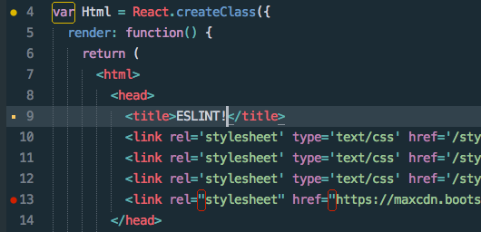

*This guide assumes you installed Node via NVM. If you installed Node as a standalone this guide may or may not work for you.*

A linter is a set of rules defined by the developer that analyzes your code to check for any problems such as syntax errors.

Using a linter is good way to catch any errors and it can also makes your code more readable and consistent. It is useful especially when working with a team of developers. Just like anything else when it comes to development, there is more than one option of linters to choose from but for this guide we will be focusing on ESlint.

If you are using Create-React-App, it already comes preconfigured with their own linter(ESlint) and its own set of rules. If we choose, we can extend the linter by adding our own rules to suit the development team's coding style.

Setting up and configuring ESLint can be a perplexing procedure since everybody's computer is setup differently. However if you installed NVM/NPM and Sublime Text the conventional way without any custom paths or configurations then this guide should be able to assist you with getting everything setup.


## Overview

Check that you have nvm, npm and Sublime Text 3 installed. 
```
$ nvm --version # 0.30.2   
$ npm -v # 6.13.7
$ subl -v # Sublime Text Build 32111`
```

If you receive a `command not found` error with any of the following commands, you will need to install that application first before continuing on. There are already plenty of guides to show you how to install the above applications.

These are the following packages ane extensions required to setup ESlint with Sublime Text 3

- **[eslint](https://eslint.org/)** - the linter used to analyze your code.
- **[SublimeLinter](https://packagecontrol.io/packages/SublimeLinter)** - extension for Sublime Text to be able to use a linter.
- **[SublimeLinter-eslint](https://packagecontrol.io/packages/SublimeLinter-eslint)** - used to configure Sublime Text to use ESlint.
- **[AirBnb eslint](https://github.com/airbnb/javascript/tree/master/packages/eslint-config-airbnb) (optional)** - a eslint configuration file created by AirBnB that we can use to extend Create-React-App's default linter rules.

Here are the following steps we will do to configure ESlint with Sublime Text.

1. Install ESlint globally
2. Install SublimeLinter package
3. Install SublimeLinter-eslint package
4. Configure Sublime Text to use ESlint
5. Extending CRA's Linter


### Install ESlint globally

`$ npm install -g eslint`

### Install SublimeLinter and SublimeLinter-eslint

In ST3 menu, go to *Preferences > Package Control > Install Package* and install the following extensions:

- SublimeLinter
- SublimeLinter-eslint

### Configure SublimeLinter

Find the pathname where node is installed

`$ which node`
*$ /home/ricky/.nvm/versions/node/v10.15.3/bin*

In ST3 menu, go to *Preferences > Settings* and add the following:
```{
    "debug": true,
    "linters": {
        "eslint": {
            "disable": false,
            "args": [],
            "excludes": [],
            "env": {
                "PATH": "~/.nvm/versions/node/v13.7.0/bin/node"
            }
        }
    }
}

```

Add the following to *Preferenes > Settings*

```
"paths": {
    "linux": ["~/.nvm/versions/node/v13.7.0/bin"]
}
```

### Setting NVM alias name

According to this **[Github issue](https://github.com/SublimeLinter/SublimeLinter/issues/128)**, if you installed Node via NVM, you need to alias the version with nvm to *default*.

`$ nvm alias default v13.7.0`

* *Change the version number to your node version ($ node --version)*


### Use AirBnB's Linter (optional)
AirBnB's ESlint's configuration file is quite popular becaue of it's extensive set of rules that it defines for you. It may be too strict for some but you can always modify any of the rules you don't need.

Download AirBnB's eslint config file

`$ npx install-peerdeps --dev eslint-config-airbnb`

If you are having any issues, you can refer to AirBnB's [documentation](https://www.npmjs.com/package/eslint-config-airbnb).


- create **.eslintrc** file inside your project's root folder and tell the config file to use AirBnB’s eslint rules and insert the following
`
{
    "extends": "airbnb"
}
`


Close Sublime Text and in order for ESlint to work, **you must open Sublime through the command line**. Go inside your project folder and enter:

`$ subl .`

Confirm that ESlint is working properly:

- You receive no errors in Sublime Text's console (*ST3 Menu > View > Show Console*)
- You see a red or yellow dot on the line of the error. The dot should dissapear once the error has been fixed.



If you have any questions or comments, please feel free to send me an email.

**Notes**

- [SublimeLinter and NVM issue](https://github.com/SublimeLinter/SublimeLinter-eslint/issues/205)
- [SublimeLinter doesn't recognize linters installed with NVM ](https://github.com/SublimeLinter/SublimeLinter/issues/128)
- [ /usr/bin/env: ‘node’: No such file or directory](https://github.com/SublimeLinter/SublimeLinter-eslint/issues/265)